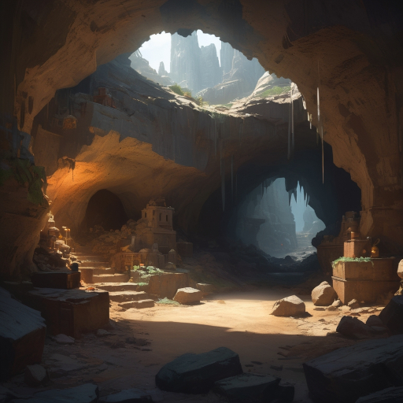

# Hrutr the captive

## Session 04 - A Mystical Place

After my latest day, I began my journey with the hope of finding a better companion for both my mind and body. I felt a bit exhausted at first, but as I started putting one foot in front of the other, I began to feel better.

> **Undertake a Journey**
>
> 4+1 - 2,3, *Strong Hit*
> 
> Waypoint. +1 Momentum, -1 Supply 

After a long trek, I discovered the entrance to a cave. I could see some light streaming in from outside, which filled me with enough confidence to enter. A completely dark cave would have been much more concerning, but this one appeared almost cozy.

> **Oracle**
> 
> Random Delve + Ironsmith Theme -> Mystical Place
> 
> Found Scrolls of Mystical Lore

Once I stepped inside, my best wishes were fulfilled. At last, some good luck! This cave seemed to be abandoned, once belonging to some kind of mystic. Regardless, it provided a great place to spend the night.

> **Resupply**
>
> 3+1 - 2,4 *Weak Hit*
>
> +2 Supply, -1 Momentum

It also had a back courtyard filled with vegetables. I dug carefully and collected the fruits I found there.

> **Making Camp**
>
> 5+3 - 3,1 *Strong Hit*
>
> +2 Supply, -1 Momentum

The rest of the night was wonderful. I’m not sure if it was the mystic presence of the place, but I experienced restorative dreams.

[Back to Session #3](session_03.html) | [Home](../../index.html) | [Session #5](session_05.html)