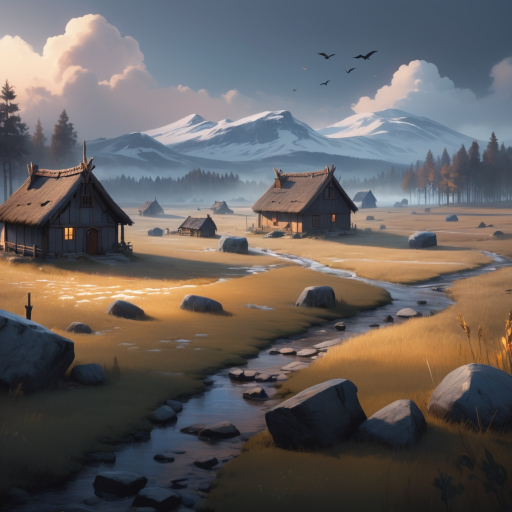

# Hrutr the captive

## Session 05 - Unexpected Surprise

With a revitalized heart, I began my journey the next day. The landscape soon filled with trees, and I started to feel as though I was losing my sense of direction.

> **Undertake a Journey**
> 
> 1+1+1 - 3,10 *Miss*
> 
> Pay the Price
 
> **Ask the Oracle**
> 
> Distract Land
> 
> -1 Supply

Upon reaching the top of a small plateau, I realized, to my dismay, that I had strayed quite far from my intended path. If I wanted to reach my destination quickly, I needed to climb a steep slope covered in rocks and bushes to gain a better vantage point for the remainder of my journey.

> **Secure an advantage**
>
> 2+1 - 1,2 *Strong Hit*
>
> +1 Next Move

Surprisingly, the climb was easier than I had anticipated, and I was finally oriented in the right direction.

> **Undertake a Journey**
>
> 6+1 - 3,9 *Weak Hit*
>
> +1 Progress, -1 Supply

I was very close to my destination, just a few hours before sunset.

> **Reach your destination**
>
> 0,9 *Miss*
>
> No progress on vow, can't rest here

> **Ask the Oracle**
> 
> Weaken Rival

Unfortunately, my fortune took a turn for the worse; the raiders were still attacking the settlement, and some houses were still ablaze. A tear rolled down my cheek as I wondered if there was still any hope left.

[Back to Session #4](session_04.html) | [Home](../../index.html)